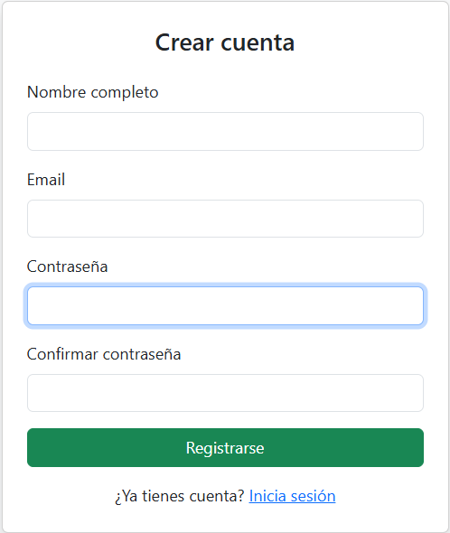
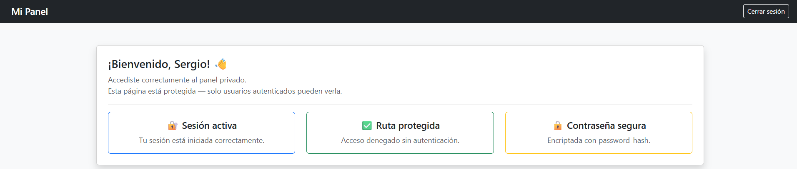

# 🔐 Sistema de Autenticación — PHP + MySQL

Sistema web completo de autenticación de usuarios desarrollado con PHP y MySQL.
Incluye registro, inicio de sesión, manejo de sesiones, dashboard privado y cierre de sesión.

---

## 📸 Capturas de pantalla

### Pantalla de Login


### Pantalla de Registro


### Dashboard privado


---

## ✅ Funcionalidades

- Registro de usuarios con validación de datos
- Inicio de sesión con verificación de credenciales
- Encriptación de contraseñas con `password_hash`
- Verificación segura con `password_verify`
- Manejo de sesiones con `$_SESSION`
- Dashboard privado accesible solo para usuarios autenticados
- Protección de rutas mediante middleware
- Cierre de sesión con destrucción de sesión

---

## 🛠️ Tecnologías utilizadas

- **PHP 8** — lógica del backend y manejo de sesiones
- **MySQL** — base de datos para almacenamiento de usuarios
- **Bootstrap 5** — interfaz responsive y componentes visuales
- **phpMyAdmin** — administración de la base de datos
- **XAMPP** — entorno de desarrollo local

---

## 📁 Estructura del proyecto

```
login-php-mysql/
│
├── auth/
│   ├── login.php         ← procesa el formulario de inicio de sesión
│   ├── register.php      ← procesa el formulario de registro
│   └── logout.php        ← destruye la sesión y redirige al login
│
├── config/
│   └── database.php      ← conexión a la base de datos (no incluido en el repo)
│
├── includes/
│   └── middleware.php    ← protege rutas privadas, verifica sesión activa
│
├── index.php             ← pantalla de inicio de sesión
├── register.php          ← pantalla de registro de usuario
├── dashboard.php         ← panel privado (requiere sesión activa)
├── database.sql          ← estructura de la base de datos para importar
├── config.example.php    ← plantilla de configuración de base de datos
└── .gitignore
```

---

## ⚙️ Cómo ejecutar este proyecto localmente

### Requisitos previos
- XAMPP instalado (Apache + MySQL)
- Navegador web

### Paso 1 — Clonar el repositorio
```bash
git clone https://github.com/sergiocl21/login-php-mysql.git
```
Mueve la carpeta clonada a `C:\xampp\htdocs\`

### Paso 2 — Configurar la base de datos
1. Abre XAMPP y arranca Apache y MySQL
2. Ve a `http://localhost/phpmyadmin`
3. Crea una base de datos llamada `login_db`
4. Selecciona la base de datos → pestaña **SQL**
5. Importa el archivo `database.sql` que está en el proyecto

### Paso 3 — Configurar la conexión
1. Copia el archivo `config.example.php`
2. Renómbralo como `database.php` y muévelo a la carpeta `config/`
3. Edita los datos de conexión con los de tu entorno local:
```php
$host     = 'localhost';
$dbname   = 'login_db';
$user     = 'root';
$password = '';
```

### Paso 4 — Abrir en el navegador
```
http://localhost/login-php-mysql/
```

---

## 🔒 Seguridad implementada

| Característica | Detalle |
|---|---|
| Encriptación de contraseñas | `password_hash()` con algoritmo BCRYPT |
| Verificación segura | `password_verify()` — nunca se compara texto plano |
| Protección de rutas | Middleware que verifica `$_SESSION` antes de cargar páginas privadas |
| Sanitización de datos | `htmlspecialchars()` para prevenir XSS en la salida |
| Credenciales fuera del repo | `config/database.php` excluido con `.gitignore` |

---

## 👤 Autor

**Sergio Calderón**
- GitHub: [@sergiocl21](https://github.com/sergiocl21)
- Email: sergiocl21@gmail.com
- Medellín, Colombia

---

## 📄 Licencia

Este proyecto es de uso libre para fines educativos y de portafolio.
